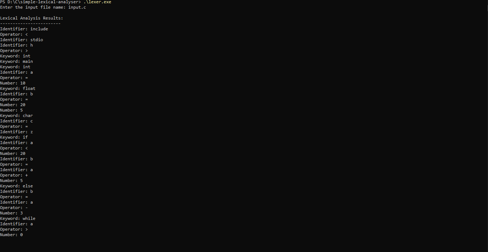

# Lexical Analyzer in C

* **Author:** Akshita Rawat
* **Intern ID:** CT04DN682
* **Company:** CODTECH IT SOLUTIONS
* **Mentor:** Neela Santosh
* **Domain:** C Programming
* **Duration:** 4 Weeks


## 📌 Overview

This project implements a **basic lexical analyzer** (lexer) in C. It reads a source code file, breaks it into meaningful tokens, and classifies them as **keywords**, **identifiers**, **operators**, or **numbers**.

The lexical analyzer does **not use regular expressions or external libraries**—all logic is implemented manually using standard C functions.


## ✅ Features

* Detects and prints:

  * **Keywords** (e.g., `int`, `if`, `return`)
  * **Identifiers** (e.g., `x`, `my_var`)
  * **Operators** (`+`, `-`, `*`, `=`, etc.)
  * **Numbers** (integer literals)
* Handles multi-character identifiers and keywords
* Ignores whitespace and newline characters
* Puts back non-token characters using `ungetc` for correct parsing


## 🛠️ Technologies Used

* **C Programming Language**
* Standard Libraries:

  * `stdio.h` – file I/O
  * `stdlib.h` – memory & exit handling
  * `string.h` – string comparison
  * `ctype.h` – character classification (`isalnum`, `isdigit`, etc.)


## 📂 File Structure

```
lexical_analyzer.c        # Main source code
input.c                   # Sample input file (user-provided)
README.md                 # Documentation
```


## ▶️ How to Compile and Run

```bash
gcc lexical_analyzer.c -o lexer
./lexer
```

Then enter your source file name (e.g., `input.c`) when prompted.


## 🔍 Sample Output



## 📚 What I Learned

* Token classification using character-by-character analysis
* Using standard C functions like `isalpha()`, `isdigit()`, `ungetc()`
* Working with file pointers to scan input character-by-character
* Writing a basic lexer as the **first phase of a compiler**